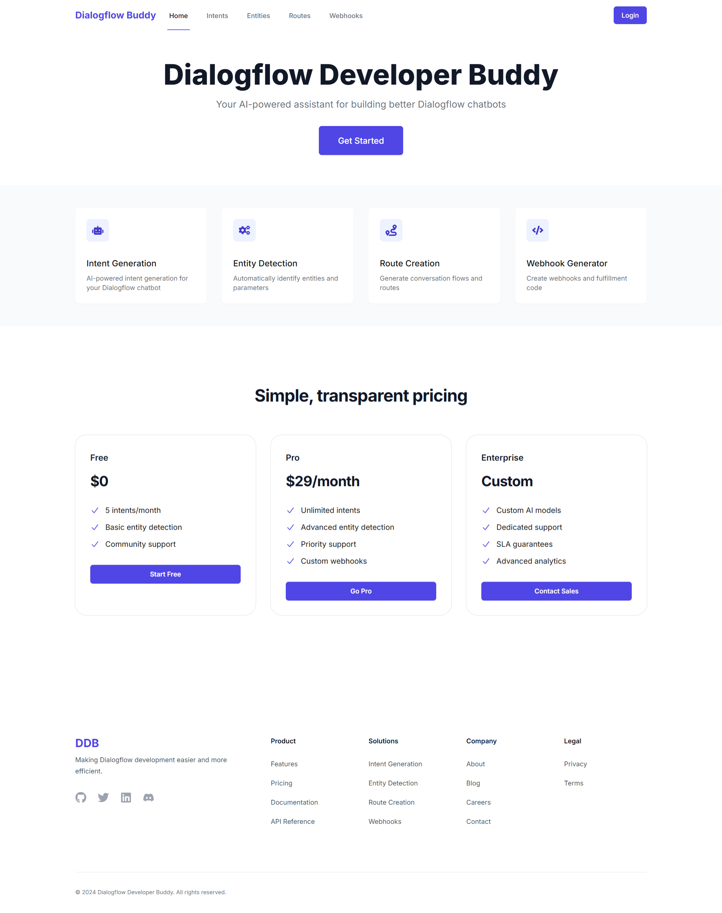
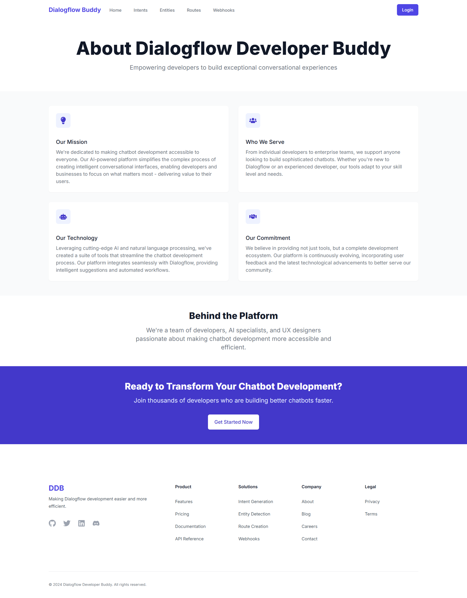
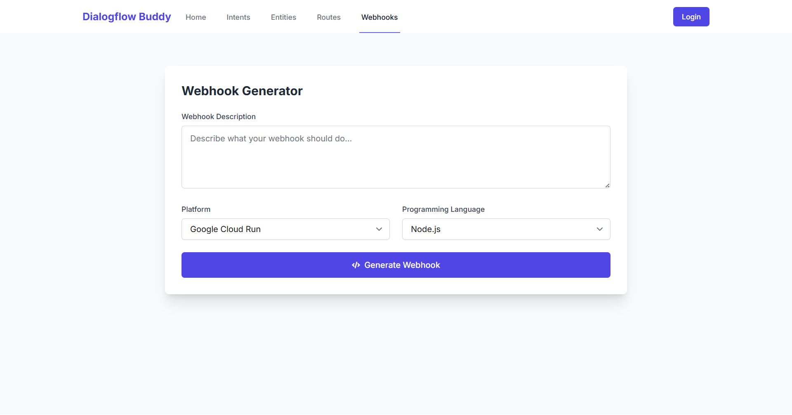

# Dialogflow SaaS


🚀 Thrilled to announce Dialogflow Buddy - The Open Source Tool Revolutionizing Chatbot Development!


Why developers are loving Dialogflow Buddy:

• Test intents instantly within one platform

• Simulate conversations in real-time

• Debug seamlessly with powerful tools

• Speed up development with an intuitive interface


As an open-source project, we're looking for community support to help Dialogflow Buddy grow! 🌱


✨ Ways to support:

• Consider sponsoring the project

• Contribute to development

• Share with your network

• Star our repository


Experience it yourself: https://lnkd.in/dHpWD9_w


Looking for organizations and individuals interested in sponsoring this open-source initiative. Your support will help us maintain and enhance this free tool for the entire developer community! 


https://lnkd.in/d6bkGWCA


Video Demo test :- https://lnkd.in/d5-a_dAt


DM me for sponsorship opportunities. Together, we can make chatbot development accessible to everyone! 💪


#OpenSource #DialogflowTools #ConversationalAI #SponsorshipOpportunity #DeveloperTools #Innovation #CommunityDriven #CCAI #Dialogflow_Buddy #Dialogflow_cx #IVR #ivr_hiring #ivrhiring

Tag a developer who would benefit from this tool! 👇

P.S. Early supporters get special recognition and exclusive access to upcoming features! Join us in shaping the future of Dialogflow development.





@Yash-Kavaiya


## Introduction

Dialogflow SaaS is a platform that enables developers to create, manage, and integrate conversational agents with ease.

## Features

- Seamless integration with various platforms
- Customizable conversational flows
- Analytics and reporting tools
- Multi-language support

## Installation

Clone the repository and install dependencies:

```bash
git clone https://github.com/yourusername/dialogflow-saas.git
cd dialogflow-saas
npm install
```

## Usage

Start the application:

```bash
npm start
```

Access the application at `http://localhost:3000`.

## Screenshots


*Caption: Dashboard showcasing conversation analytics.*


*Caption: Illustration of Feature 1.*


*Caption: Illustration of Feature 2.*


*Caption: Settings page overview.*

## Documentation

For detailed information, refer to the [documentation](./docs/README.md).

## Contributing

Contributions are welcome. Please read the [contributing guidelines](./CONTRIBUTING.md) before submitting a pull request.

## License

This project is licensed under the MIT License.
